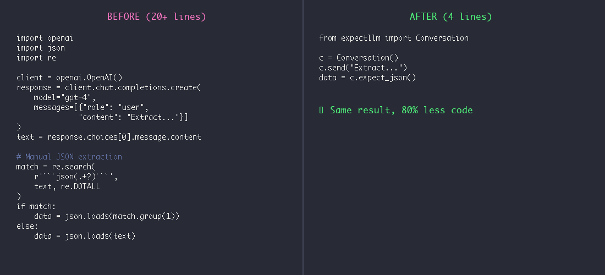

# llm-expect

[](https://badge.fury.io/py/llm-expect)
[](https://www.python.org/downloads/)
[](https://opensource.org/licenses/MIT)
[](https://github.com/entropyvector/llm-expect/actions/workflows/ci.yml)

> Expect scripts for LLM conversations.

**The insight:** Agents are just expect scripts. Send a message, expect a pattern, branch on the match. That's it.

<p align="center">
  
</p>

## Table of Contents

- [Why llm-expect?](#why-llm-expect)
- [Requirements](#requirements)
- [Installation](#installation)
- [Quick Start](#quick-start)
- [Before/After](#beforeafter)
- [Features](#features)
- [API Reference](#api-reference)
- [Examples](#examples)
- [Environment Variables](#environment-variables)
- [Prompting Tips](#prompting-tips)
- [Important Notes](#important-notes)
- [Contributing](#contributing)
- [License](#license)

## Why llm-expect?

1. **Zero boilerplate** — No chains, no schemas, no output parsers. Just send and expect.
2. **Pattern-first design** — Use regex patterns you already know. The LLM adapts to your format, not the other way around.
3. **Conversation as state machine** — Each expect is a transition. Branch on match, retry on failure, build complex flows naturally.
4. **Provider agnostic** — Works with OpenAI, Anthropic, or any compatible API. Switch providers without changing code.
5. **Debuggable** — Every step is visible. No hidden prompts, no magic. Print the history, see what happened.
6. **Lightweight** — Single file, minimal dependencies. No framework lock-in.
7. **Unix philosophy** — Do one thing well. Compose with your existing tools.

## Requirements

- Python 3.9+
- API key for at least one provider (OpenAI or Anthropic)

## Installation

```bash
# Core only (no providers)
pip install llm-expect

# With specific provider
pip install llm-expect[openai]
pip install llm-expect[anthropic]

# All providers
pip install llm-expect[all]
```

## Quick Start

```python
from llmexpect import Conversation

c = Conversation()
c.send("Is Python dynamically typed? Reply YES or NO")

if c.expect_yesno():
    print("Correct!")
```

That's it. Send a message, expect a pattern, branch on the result.

## Before/After

<p align="center">
  
</p>

**Traditional approach (20+ lines):**
```python
from langchain.chat_models import ChatOpenAI
from langchain.output_parsers import PydanticOutputParser
from pydantic import BaseModel, Field
# ... setup, chains, error handling ...
```

**llm-expect (4 lines):**
```python
from llmexpect import Conversation

c = Conversation()
c.send("Review this code. Reply with SEVERITY: low/medium/high",
       expect=r"SEVERITY: (low|medium|high)")
severity = c.match.group(1)
```

## Features

### Pattern-to-Prompt

When you pass an `expect` pattern to `send()`, llm-expect automatically appends format instructions:

```python
# You write:
c.send("Is this secure?", expect=r"^(YES|NO)$")

# llm-expect sends:
# "Is this secure?
#
#  Reply with exactly 'YES' or 'NO'."
```

### Expect Templates

No regex needed for common patterns:

```python
# Extract JSON
c.send("Return user data as JSON")
data = c.expect_json()  # Returns dict

# Extract numbers
c.send("How many items?")
count = c.expect_number()  # Returns int

# Yes/No questions
c.send("Is this valid? Reply YES or NO")
if c.expect_yesno():  # Returns bool
    print("Valid!")

# Multiple choice
c.send("Classify as: bug, feature, or docs")
category = c.expect_choice(["bug", "feature", "docs"])

# Extract code
c.send("Write a Python function")
code = c.expect_code("python")  # Returns code string
```

## API Reference

### Conversation

```python
c = Conversation(
    model="claude-sonnet-4-20250514",  # Optional, auto-detected from env
    system_prompt="You are helpful",   # Optional
    timeout=60,                        # Default timeout in seconds
    provider="anthropic",              # Optional: "openai" or "anthropic"
    max_history=20                     # Optional: limit conversation history
)
```

### Methods

| Method | Returns | Description |
|--------|---------|-------------|
| `send(message, expect=None)` | `str` | Send message, optionally validate pattern |
| `expect(pattern, flags=0)` | `bool` | Match pattern in last response |
| `send_expect(message, pattern)` | `Match` | Send and expect in one call |
| `expect_json()` | `dict` | Extract JSON from response |
| `expect_number()` | `int` | Extract first number |
| `expect_choice(choices)` | `str` | Match one of the choices |
| `expect_yesno()` | `bool` | Match yes/no variants |
| `expect_code(language=None)` | `str` | Extract code block |
| `clear_history()` | `None` | Clear conversation history |

### Properties

| Property | Type | Description |
|----------|------|-------------|
| `match` | `Match \| None` | Last successful match object |
| `history` | `List[Dict]` | Conversation history (copy) |
| `last_response` | `str` | Most recent response |

### Exceptions

| Exception | When |
|-----------|------|
| `ExpectError` | Pattern not found in response |
| `ProviderError` | API call failed |
| `ConfigError` | Missing API key or invalid config |

## Examples

### Extract Structured Data

<p align="center">
  
</p>

```python
from llmexpect import Conversation

c = Conversation()
c.send("Parse this: 'Meeting with John at 3pm tomorrow'")
event = c.expect_json()  # {"person": "John", "time": "3pm", "date": "tomorrow"}
```

### Multi-Turn Code Review

```python
from llmexpect import Conversation, ExpectError
import re

code = '''
def process_user(data):
    query = f"SELECT * FROM users WHERE id = {data['id']}"
    return db.execute(query)
'''

c = Conversation()
c.send(f"Review this code for security issues:\n```python\n{code}\n```")
c.expect(r"(found (\d+) issues|no issues found)", re.IGNORECASE)

if c.match.group(2) and int(c.match.group(2)) > 0:
    c.send("List the issues with severity ratings")
    c.expect(r"(critical|high|medium|low)", re.IGNORECASE)
    print(c.last_response)
```

### Data Extraction

```python
from llmexpect import Conversation

text = "Contact John Smith at john@example.com or 555-1234"

c = Conversation()
c.send(f"""Extract contact info from:
{text}

Format:
NAME: <name>
EMAIL: <email>
PHONE: <phone>""")
c.expect(r"NAME: (.+)\nEMAIL: (.+)\nPHONE: (.+)")

print(f"Name: {c.match.group(1)}")
print(f"Email: {c.match.group(2)}")
print(f"Phone: {c.match.group(3)}")
```

### Retry Pattern

<p align="center">
  
</p>

```python
from llmexpect import Conversation, ExpectError

def analyze_document(text: str, max_retries: int = 3) -> dict:
    c = Conversation(system_prompt="You are a document analyzer.")
    c.send(f"Analyze this document and extract key entities:\n\n{text}")

    for attempt in range(max_retries):
        try:
            return c.expect_json()
        except ExpectError:
            if attempt < max_retries - 1:
                c.send("Please format your response as valid JSON.")

    raise ExpectError("Failed to extract JSON after retries")
```

## Environment Variables

Set your API key:

```bash
# For Anthropic (Claude)
export ANTHROPIC_API_KEY="your-key"

# For OpenAI (GPT)
export OPENAI_API_KEY="your-key"
```

llm-expect auto-detects the provider from the environment. Anthropic is preferred if both are set.

## Prompting Tips

For reliable pattern matching:

1. **Be explicit about format**: "Reply with exactly 'YES' or 'NO'"
2. **Use examples**: "Format: SCORE: 8/10"
3. **Constrain output**: "Reply with just the number, nothing else"
4. **Use code blocks**: "Put your JSON in a ```json code block"

## Important Notes

**LLM Non-Determinism**: LLM outputs are inherently non-deterministic. The same prompt may produce different responses across calls. For production use:

- Use explicit format instructions (llm-expect does this automatically with `expect=`)
- Implement retry logic for critical extractions
- Consider temperature=0 for more consistent outputs
- Test patterns against varied response formats

**Not a Testing Framework**: llm-expect is for *scripting conversations*, not for unit testing LLM outputs. For assertions about LLM behavior, combine with your existing test framework.

## Contributing

See [CONTRIBUTING.md](CONTRIBUTING.md) for development setup and guidelines.

## License

MIT License - see [LICENSE](LICENSE) for details.
